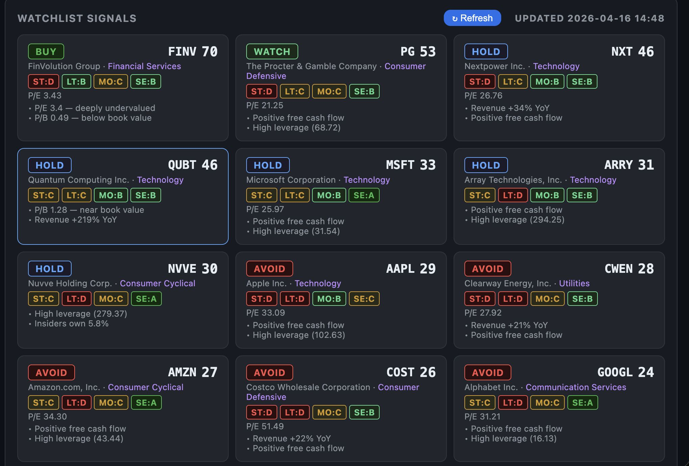
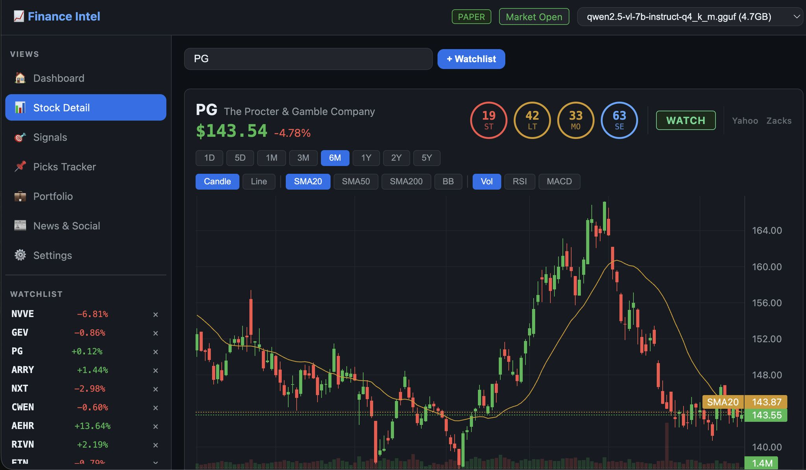
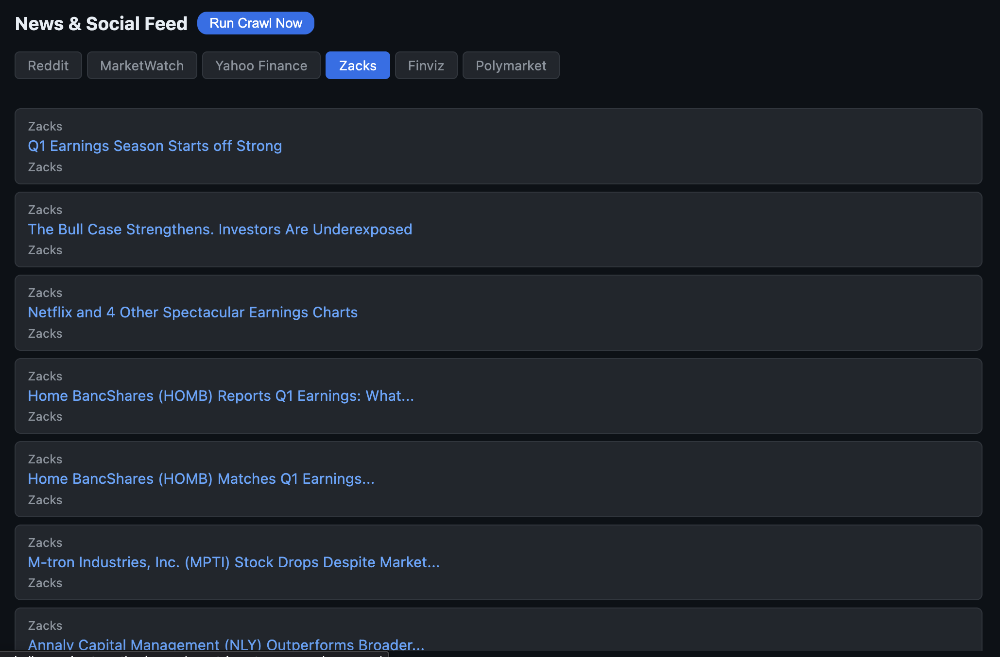

# Finance Intelligence Platform

A full-stack, locally-run AI-powered finance dashboard. Runs any GGUF LLM model locally on Apple Silicon with Metal GPU acceleration—no cloud API required.

**Two integrated interfaces:**
- **Chat Interface** (`http://localhost:8000`) — General-purpose AI chat with web search, RAG, vision analysis, and model fine-tuning
- **Finance Dashboard** (`http://localhost:8000/finance`) — Market intelligence: real-time quotes, technical signals, paper trading, SEC filings analysis, macro indicators, and AI-powered insights

All data processing and LLM inference runs locally. Optional integrations available for live trading (Alpaca), macro data (FRED), and ticker normalization (OpenFIGI).

---

## Screenshots

**Watchlist Signals** — per-symbol scoring cards with BUY/WATCH/HOLD/AVOID rating, composite score, short/long-term/momentum/sentiment breakdown, and key fundamental highlights:



**Stock Detail** — candlestick chart with SMA/BB/RSI/MACD overlays, multi-timeframe selector (1D–5Y), four-quadrant signal scores (ST/LT/MO/SE), and live watchlist sidebar:





---

## Tech Stack

| Component | Technology |
|---|---|
| **Backend** | FastAPI + Server-Sent Events (SSE) streaming |
| **LLM Inference** | `llama-cpp-python` with GGUF models and Apple Metal acceleration |
| **Embeddings** | `nomic-embed-text-v1.5` (sentence-transformers) |
| **Vector Store** | ChromaDB (chat RAG + finance filings) |
| **Database** | SQLite — single `finance.db` for all app state |
| **Market Data** | yfinance (prices, OHLCV, technicals, news) |
| **SEC Filings** | EDGAR API + XBRL company facts |
| **Macro Data** | FRED (Federal Reserve Economic Data) |
| **Ticker Normalization** | OpenFIGI |
| **Web Crawling** | Playwright (Reddit, MarketWatch, Finviz, Polymarket, Seeking Alpha) |
| **Task Scheduling** | APScheduler (crawls, signal scoring, RAG ingestion) |
| **Broker Integration** | Alpaca (paper + live US equities trading) |
| **Web Search** | DuckDuckGo, Google News RSS |
| **Web Scraping** | trafilatura + BeautifulSoup |
| **Fine-Tuning** | `mlx-lm` (LoRA on Apple Silicon) |
| **Finance Frontend** | TypeScript + esbuild (no framework, ~60kb bundle) |

---

## Quick Start

### 1. Download an LLM Model

Place a GGUF quantized model in `app/models/`:

```bash
# Option A: Qwen 2.5 14B (~32GB RAM, excellent reasoning)
curl -L -o app/models/qwen-14b.gguf \
  'https://huggingface.co/bartowski/Qwen2.5-14B-Instruct-GGUF/resolve/main/qwen2.5-14b-instruct.Q4_K_M.gguf'

# Option B: Llama 3.1 8B (~16GB RAM, balanced)
curl -L -o app/models/llama-8b.gguf \
  'https://huggingface.co/bartowski/Meta-Llama-3.1-8B-Instruct-GGUF/resolve/main/Meta-Llama-3.1-8B-Instruct-Q4_K_M.gguf'

# Option C: Mistral 7B (~14GB RAM, fast)
curl -L -o app/models/mistral-7b.gguf \
  'https://huggingface.co/TheBloke/Mistral-7B-Instruct-v0.2-GGUF/resolve/main/mistral-7b-instruct-v0.2.Q4_K_M.gguf'
```

### 2. One-time Setup

```bash
cd app
chmod +x setup.sh start.sh
./setup.sh
```

This:
- Creates a Python virtual environment in `backend/venv/`
- Compiles `llama-cpp-python` with Metal GPU acceleration for Apple Silicon
- Installs all dependencies (FastAPI, finance libraries, web scrapers, etc.)

### 3. Configure

Copy the template and fill in your values:

```bash
cp app/backend/.env.example app/backend/.env
```

**Minimum required:**

```ini
MODEL_PATH=../models/your-model.gguf
```

**Optional API keys** (finance features work without these, but are enhanced by them):

```ini
ALPACA_API_KEY=...       # Paper/live trading — free at alpaca.markets
ALPACA_SECRET_KEY=...
FRED_API_KEY=...         # Macro data — free at fred.stlouisfed.org
OPENFIGI_API_KEY=...     # Ticker normalization (optional, raises rate limits)
```

### 4. Run

```bash
cd app
./start.sh
```

Then open:
- **Chat** → `http://localhost:8000`
- **Finance** → `http://localhost:8000/finance`

Or start the API manually:

```bash
cd app/backend
source ../venv/bin/activate
uvicorn main:app --reload --host 0.0.0.0 --port 8000
```

---

## Features

### Chat Interface

- **Multi-turn conversations** with real-time streaming and stop-generation controls
- **Web access** — URL fetching, DuckDuckGo search, Google News RSS feed
- **Vision** — Image upload with LLaVA/Llama-Vision/Qwen-VL support; auto model-swap for vision tasks
- **RAG (Retrieval-Augmented Generation)** — Crawl URLs, paste text, ChromaDB vector search, toggle per-session
- **Hot-swap models** from the UI — no restart needed
- **Fine-tuning** — Upload JSONL/CSV/TXT, train LoRA adapters with live loss monitoring, export to GGUF

### Finance Dashboard

#### Market Intelligence
- **Signal Scoring** — Value metrics (P/E, P/B, EV/EBITDA, FCF), technicals (RSI, SMA, MACD, Bollinger bands), analyst consensus → graded A–D
- **Candlestick Charts** — OHLCV + volume + SMA overlays (20/50/200) via TradingView Lightweight Charts
- **Watchlist** — Live quotes, per-symbol signal grades, custom tags
- **Screeners** — Filter stocks by technical/fundamental criteria

#### Portfolio & Trading
- **Paper Trading** — Alpaca integration for market/limit orders, position tracking, P&L calculations
- **Picks Tracker** — Log model recommendations, track vs entry price, log outcome, view win-rate stats

#### Research
- **SEC EDGAR** — 10-K, 10-Q, 8-K filings indexed in ChromaDB; LLM answers questions from actual filing text
- **XBRL Financials** — 5-year revenue, net income, EPS, cash flow, assets, debt extracted from EDGAR
- **FRED Macro** — GDP, CPI, Fed Funds rate, unemployment, yield curve, VIX, M2, retail sales injected into LLM context
- **News & Social** — Crawled from Reddit finance subs, MarketWatch, Finviz, Polymarket, Seeking Alpha (scheduled, sequential)

#### AI Analysis
- **AI Analyst** — LLM with auto-injected market context: live prices, news, FRED macro data, RAG-retrieved filings → streaming Q&A
- **Extended Insights** — Full AI-generated reports per symbol: valuation summary, technical outlook, macro impact, upcoming catalysts, risks, and bottom line — streamed token-by-token
- **AI Recommendations** — Scheduled LLM sweep of watchlist generates ranked buy/hold/avoid picks stored and refreshed every 6 hours
- **Sentiment Analysis** — Per-symbol sentiment scores derived from crawled news and social feeds, cached and updated with each crawl cycle

#### Screeners

Built-in screeners run on a schedule and are accessible on-demand:

| Screener | Focus |
|----------|-------|
| `undervalued` | Low P/E, P/B, EV/EBITDA with solid fundamentals |
| `momentum` | Strong RSI + SMA alignment + price trend |
| `growth` | Revenue + earnings acceleration |
| `dividend` | Yield + payout stability |
| `beaten_down` | Oversold with improving fundamentals |
| `moonshots` | High-risk high-reward speculative setups |
| Sector-specific | Tech, energy, healthcare, financials, etc. |

#### Volume Analysis
- **Rolling Volume Scoring** — Configurable background job scores stocks by volume relative to average, flags unusual accumulation/distribution, and maintains a ranked result list updated every minute

---

## Project Structure

```
app/
├── backend/
│   ├── main.py                 # FastAPI app entry point — chat, RAG, model routes, SSE
│   ├── finance_router.py       # /api/finance/* aggregator — EDGAR, FRED, LLM, insights, scheduler
│   ├── market_router.py        # Market data routes — stock, chart, news, quotes, peers
│   ├── signals_router.py       # Signal scoring, screeners, recommendations, sentiment, volume
│   ├── broker_router.py        # Watchlist, picks, Alpaca trading, crawl routes
│   ├── market.py               # yfinance wrapper — prices, OHLCV, technicals, rate-limit backoff
│   ├── signals.py              # Signal scoring engine (value + technicals + analyst → A–D grade)
│   ├── fundamentals.py         # SEC EDGAR XBRL, FRED macro indicators, OpenFIGI
│   ├── broker.py               # Alpaca integration — orders, positions, P&L
│   ├── db.py                   # SQLite persistence (finance.db)
│   ├── crawler.py              # Playwright crawlers — Reddit, MarketWatch, Finviz, etc.
│   ├── scheduler.py            # APScheduler background jobs
│   ├── scraper.py              # Async HTTP scraper (trafilatura + BeautifulSoup)
│   ├── refresh_symbols.py      # Bulk ticker lookup + autocomplete cache
│   ├── ai/
│   │   ├── llm.py              # llama-cpp-python wrapper with Metal GPU
│   │   ├── rag.py              # ChromaDB + sentence-transformer embeddings
│   │   ├── ingestion.py        # Document → chunk → embed → ChromaDB pipeline
│   │   ├── trainer.py          # MLX LoRA fine-tuning + GGUF export
│   │   └── prompts.py          # Prompt templates by model family
│   ├── core/
│   │   ├── db.py               # DB connection + schema init
│   │   ├── activity.py         # SSE event emitter for real-time UI updates
│   │   └── http_retry.py       # Exponential backoff for external HTTP calls
│   ├── requirements.txt
│   ├── .env                    # Local config (gitignored)
│   ├── .env.example            # Config template
│   └── tests/
├── frontend/
│   ├── src/
│   │   ├── types.ts            # Shared TypeScript interfaces
│   │   ├── api.ts              # HTTP client (fetch wrapper)
│   │   ├── utils.ts            # Formatters, number parsing, helpers
│   │   ├── state.ts            # Global mutable state (watchlist, settings)
│   │   ├── router.ts           # Hash-based routing
│   │   ├── dashboard.ts        # Main dashboard view
│   │   ├── watchlist.ts        # Watchlist CRUD UI
│   │   ├── stock.ts            # Stock detail page
│   │   ├── chart.ts            # TradingView Lightweight Charts (OHLCV + overlays)
│   │   ├── signals.ts          # Signal grades + screener UI
│   │   ├── picks.ts            # Picks tracker
│   │   ├── broker.ts           # Portfolio + order placement
│   │   ├── feed.ts             # News & social feed
│   │   ├── chat.ts             # AI chat interface
│   │   ├── volume.ts           # Volume analysis view
│   │   ├── activities.ts       # Activity log viewer
│   │   ├── settings.ts         # Admin panel + job config
│   │   └── main.ts             # Entry point
│   ├── index.html
│   ├── tsconfig.json
│   └── package.json
├── train/
│   ├── train.py                # MLX LoRA training script
│   ├── prepare_data.py         # Dataset preparation
│   ├── export.py               # Export adapter → GGUF
│   └── adapters/               # Trained LoRA adapters (gitignored)
├── models/                     # GGUF model files (gitignored)
├── data/                       # Auto-created at runtime (gitignored)
│   ├── finance.db              # Single SQLite DB
│   └── chroma/                 # ChromaDB vector index
├── docs/
│   └── screenshots/            # UI screenshots
├── setup.sh
└── start.sh
```

---

## Backend Modules

| Module | Responsibility |
|---|---|
| `main.py` | FastAPI app entry point — chat, RAG, model hot-swap, vision, SSE streaming, lifespan setup |
| `finance_router.py` | `/api/finance/*` aggregator — EDGAR, FRED, macro, insights, scheduler, admin config |
| `market_router.py` | Market data routes — stock info, OHLCV charts, news, live quotes, peers |
| `signals_router.py` | Signal scoring, screeners, recommendations, sentiment, volume analysis |
| `broker_router.py` | Watchlist, picks tracker, Alpaca orders/positions/P&L, crawl triggers |
| `market.py` | yfinance wrapper — live quotes, OHLCV history, RSI/MACD/Bollinger/SMA, rate-limit backoff |
| `signals.py` | Signal scoring engine — P/E, P/B, EV/EBITDA, FCF yield, technicals, analyst consensus → A–D grade |
| `fundamentals.py` | SEC EDGAR XBRL financials, FRED macro indicators, OpenFIGI ticker normalization |
| `broker.py` | Alpaca integration — market/limit orders, positions, account, P&L (paper + live) |
| `crawler.py` | Playwright crawlers — Reddit, MarketWatch, Finviz, Polymarket, Seeking Alpha (throttled, sequential) |
| `scheduler.py` | APScheduler background jobs — crawling, scoring, ingestion, recommendations, volume analysis |
| `scraper.py` | Async HTTP scraper — trafilatura + BeautifulSoup content extraction |
| `refresh_symbols.py` | Bulk ticker lookup via OpenFIGI/yfinance; populates symbol autocomplete table |
| `ai/llm.py` | llama-cpp-python wrapper — Metal GPU config, streaming inference, vision model auto-swap |
| `ai/rag.py` | ChromaDB wrapper — document chunking, sentence-transformer embeddings, similarity retrieval |
| `ai/ingestion.py` | RAG ingestion pipeline — parse → chunk → embed → ChromaDB |
| `ai/trainer.py` | MLX LoRA fine-tuning — dataset upload, live loss streaming, GGUF export |
| `ai/prompts.py` | Prompt template selection by model family (Llama, Mistral, Qwen, Phi, etc.) |
| `core/activity.py` | SSE event emitter for real-time progress broadcasts to the UI |
| `core/http_retry.py` | Exponential backoff decorator for external HTTP calls |
| `core/db.py` | DB connection management + schema initialization |

---

## Data Storage

All application state is stored in a **single SQLite database** at `app/data/finance.db`. Nothing is scattered across multiple files or directories.

| Table | Contents |
|---|---|
| `watchlist` | Tracked symbols |
| `picks` | Model-recommended trades + outcomes |
| `crawl_cache` | Scraped web content, scored results |
| `symbols` | Ticker + company name for autocomplete |
| `sentiment` | Per-symbol sentiment cache |
| `rag_sources` | RAG document sources (replaces `sources.json`) |
| `app_settings` | Key-value settings, e.g. last-selected model |
| `screener_results` | Screener output cache |
| `recommendations` | AI-generated stock recommendations |
| `volume_analysis_*` | Volume scoring tasks + results |
| `extended_insights` | Per-symbol AI-generated insights |

ChromaDB (`data/chroma/`) is separate — it's a vector index managed by the ChromaDB library and can't be merged into SQLite without replacing the library.

---

## Environment Variables

### Chat / LLM Core

| Variable | Default | Description |
|---|---|---|
| `MODEL_PATH` | *(required)* | Path to GGUF model file |
| `VISION_MODEL_PATH` | *(auto-detect)* | Vision model path (if different) |
| `N_CTX` | `4096` | Context window (tokens) |
| `N_GPU_LAYERS` | `-1` | GPU layers (`-1` = all on Metal) |
| `N_THREADS` | `8` | CPU threads for inference |
| `EMBED_MODEL` | `nomic-ai/nomic-embed-text-v1.5` | RAG embedding model |
| `CHUNK_SIZE` | `512` | Tokens per RAG chunk |
| `DATA_DIR` | `../data` | Path to `finance.db` + ChromaDB |
| `HF_TOKEN` | *(optional)* | HuggingFace token (for fine-tuning) |

### Finance

| Variable | Default | Description |
|---|---|---|
| `ALPACA_API_KEY` | *(optional)* | Alpaca API key (trading) |
| `ALPACA_SECRET_KEY` | *(optional)* | Alpaca secret key |
| `ALPACA_PAPER` | `true` | Paper trading mode |
| `FRED_API_KEY` | *(optional)* | FRED API key (macro data) |
| `OPENFIGI_API_KEY` | *(optional)* | OpenFIGI API key |
| `CRAWL_INTERVAL_MIN` | `60` | Crawler interval (minutes) |

---

## Rate Limiting & Resilience

**yfinance** has strict rate limits (~100–150 concurrent requests). The app handles this transparently:

- **Exponential backoff** on market data fetches (0.5s → 1.0s → 2.0s delays)
- **Request throttling** in signal scoring (0.2–0.3s between stock scores)
- **Sequential crawlers** (Reddit, MarketWatch, etc.) to avoid thundering herd
- **Graceful degradation** — missing data doesn't break the UI

With 2,000 stocks, full scoring takes ~33 hours but runs in background. Charts, quotes, and picks work independently.

---

## Fine-tuning

Upload a dataset and train a LoRA adapter on your local GPU:

1. **Train tab** → Upload JSONL/CSV/TXT
   - JSONL format: `{"prompt":"Q: ...","completion":"A: ..."}`
   - CSV: columns `prompt,completion`
   - TXT: one example per line

2. Configure hyperparameters → **Start Training**
   - Watch live loss curve
   - Adapters save to `train/adapters/<dataset>/`

3. Export to GGUF:

```bash
cd app/train
python export.py \
  --model mistralai/Mistral-7B-Instruct-v0.2 \
  --adapters ./adapters/my-dataset \
  --output ../models/my-finetuned.gguf \
  --quantize q4_k_m
```

4. Update `MODEL_PATH` in `backend/.env` and restart.

---

## Development

### Run Backend Tests

```bash
cd app
./run_tests.sh

# Or directly:
cd app/backend
source venv/bin/activate
python -m pytest tests/ -v
```

### Finance Frontend Dev Server

```bash
cd app/frontend
npm install
npm run dev       # hot reload at http://localhost:3000
npm run typecheck # type errors only
npm run lint      # ESLint
```

### Production Frontend Build

```bash
cd app/frontend
npm run build
```

Outputs `dist/main.js` (~60kb). FastAPI serves `index.html` directly — no deploy step needed.

---

## Troubleshooting

### Model Loading Issues

```bash
# Check Metal compilation
python -c "import llama_cpp; print(llama_cpp.__version__)"

# Test model load
cd app/backend && source venv/bin/activate
python -c "from llm import LLMEngine; print('OK')"
```

### Rate Limiting on Market Data

Check logs for `Rate limited, retry X/Y`. This is normal under load. Signal scoring runs in background; watchlist updates work immediately.

### Finance Data Missing

- Verify `ALPACA_API_KEY` and `FRED_API_KEY` in `backend/.env`
- Check scheduler logs for crawler errors
- XBRL data takes 10–20 seconds per ticker (runs async)

### Fine-tuning Crashes

Ensure:
- `N_GPU_LAYERS=-1` (uses Metal, not CPU-only)
- Model is supported by `mlx-lm` (Llama, Mistral, Qwen, etc.)
- Dataset is valid JSONL/CSV/TXT

---

## API Endpoints

### Chat & RAG (`main.py`)

| Method | Path | Description |
|--------|------|-------------|
| `POST` | `/api/chat` | Stream chat with RAG/web search; supports image upload + vision |
| `GET` | `/api/sources` | List knowledge base sources |
| `POST` | `/api/sources/url` | Crawl URL into RAG |
| `POST` | `/api/sources/text` | Add raw text to RAG |
| `DELETE` | `/api/sources/{source_id}` | Remove source |
| `POST` | `/api/sources/retrain` | Re-crawl and re-index all URL sources |
| `GET` | `/api/models` | List available GGUF models |
| `GET` | `/api/model` | Current model info |
| `POST` | `/api/models/switch` | Hot-swap model (no restart) |
| `GET` | `/api/health` | App health + model load status |
| `GET` | `/api/activity` | SSE stream of real-time activity events |
| `POST` | `/api/seed` | Index built-in finance/news seed sources |
| `GET` | `/api/seed` | List seed sources and index status |

### Fine-tuning

| Method | Path | Description |
|--------|------|-------------|
| `GET` | `/api/train/status` | Training job status |
| `GET` | `/api/train/log` | Training log entries |
| `GET` | `/api/train/datasets` | List uploaded datasets |
| `GET` | `/api/train/adapters` | List trained LoRA adapters |
| `POST` | `/api/train/datasets/upload` | Upload JSONL/CSV/TXT dataset |
| `POST` | `/api/train/start` | Start LoRA fine-tuning |
| `POST` | `/api/train/stop` | Stop active training |
| `GET` | `/api/train/stream` | SSE stream of live training output |

### Market Data (`market_router.py`)

| Method | Path | Description |
|--------|------|-------------|
| `GET` | `/api/finance/stock/{symbol}` | Price, P/E, P/B, dividend, beta, sector, description |
| `GET` | `/api/finance/chart/{symbol}` | OHLCV candles + SMA(20/50/200) + RSI for period |
| `GET` | `/api/finance/news/{symbol}` | Recent news articles (default 15) |
| `GET` | `/api/finance/quotes` | Live quotes for all watchlist symbols |
| `GET` | `/api/finance/peers/{symbol}` | Sector peer quotes |
| `GET` | `/api/finance/yfinance-status` | yfinance session health + blocklist |
| `DELETE` | `/api/finance/market/not-found-blocklist` | Clear 404 symbol cache |

### Signals & Screeners (`signals_router.py`)

| Method | Path | Description |
|--------|------|-------------|
| `GET` | `/api/finance/signal/{symbol}` | Score single stock → A–D grade (fundamentals + technicals + sentiment) |
| `GET` | `/api/finance/signals/watchlist` | Score all watchlist symbols (cached) |
| `GET` | `/api/finance/screeners` | List available screeners |
| `GET` | `/api/finance/screeners-cached` | Get all cached screener results |
| `GET` | `/api/finance/screen/{name}` | Get screener results (cached, fallback to live) |
| `POST` | `/api/finance/screen/{name}/run` | Force-run screener in background |
| `GET` | `/api/finance/recommendations` | AI recommendations for watchlist |
| `POST` | `/api/finance/recommendations/run` | Generate recommendations in background |
| `GET` | `/api/finance/sentiment/{symbol}` | Cached sentiment for symbol |
| `GET` | `/api/finance/sentiment` | All cached sentiment |
| `GET` | `/api/finance/volume-analysis/results` | Cached volume analysis scores |
| `POST` | `/api/finance/volume-analysis/run` | Force-run volume analysis |
| `POST` | `/api/finance/volume-analysis/rescore/{symbol}` | Rescore single symbol |

### Watchlist, Picks & Broker (`broker_router.py`)

| Method | Path | Description |
|--------|------|-------------|
| `GET` | `/api/finance/watchlist` | Get all watched symbols |
| `POST` | `/api/finance/watchlist` | Add symbol |
| `DELETE` | `/api/finance/watchlist/{symbol}` | Remove symbol |
| `GET` | `/api/finance/picks` | All picks with live P&L |
| `GET` | `/api/finance/picks/stats` | Win rate + aggregate stats |
| `POST` | `/api/finance/picks` | Log new pick (entry, direction, target, stop) |
| `PUT` | `/api/finance/picks/{pick_id}/close` | Close pick with exit price + outcome |
| `GET` | `/api/finance/broker/account` | Account summary (cash, buying power, net worth) |
| `GET` | `/api/finance/broker/positions` | Current open positions |
| `GET` | `/api/finance/broker/orders` | Order history |
| `GET` | `/api/finance/broker/clock` | Market hours + SPY snapshot |
| `POST` | `/api/finance/broker/order` | Place market or limit order |
| `DELETE` | `/api/finance/broker/order/{order_id}` | Cancel order |
| `GET` | `/api/finance/crawl/{source}` | Crawled news/sentiment for source |
| `GET` | `/api/finance/crawl` | All crawl results |
| `POST` | `/api/finance/crawl/run` | Trigger full crawl in background |

### Research & AI (`finance_router.py`)

| Method | Path | Description |
|--------|------|-------------|
| `GET` | `/api/finance/edgar/filings/{symbol}` | 10-K, 10-Q, 8-K filings |
| `GET` | `/api/finance/edgar/financials/{symbol}` | 5-year XBRL financial history |
| `GET` | `/api/finance/edgar/cik/{symbol}` | SEC CIK number |
| `GET` | `/api/finance/macro/snapshot` | FRED macro snapshot (GDP, CPI, Fed rate, etc.) |
| `GET` | `/api/finance/macro/series/{series_id}` | Historical FRED series |
| `GET` | `/api/finance/macro/series` | List available FRED series |
| `POST` | `/api/finance/ingest/{symbol}` | Ingest SEC filings into RAG |
| `POST` | `/api/finance/ingest/run/all` | Ingest entire watchlist |
| `POST` | `/api/finance/llm/stream` | Stream finance-aware Q&A with injected market context |
| `GET` | `/api/finance/extended-insights/{symbol}` | Cached AI insight (valuation, technicals, macro, catalysts, risks) |
| `POST` | `/api/finance/extended-insights/{symbol}/run` | Generate insight in background |
| `GET` | `/api/finance/extended-insights/{symbol}/stream` | Stream insight tokens |
| `GET` | `/api/finance/symbols` | Symbol autocomplete (~10k tickers) |
| `GET` | `/api/finance/health` | Finance subsystem health |
| `GET` | `/api/finance/scheduler/jobs` | All scheduled job status |
| `GET` | `/api/finance/jobs/stream` | SSE stream of job status |
| `POST` | `/api/finance/jobs/{job_id}/run` | Trigger job immediately |
| `POST` | `/api/finance/jobs/{job_id}/stop` | Stop job |

---

## Deployment Notes

This app is **designed for local use only**:
- No authentication (assumes trusted local network)
- No rate limiting on `/api/` endpoints
- API keys stored in plaintext in `.env`

For cloud deployment:
1. Add authentication (OAuth, API keys)
2. Move secrets to environment variables or secrets manager
3. Add rate limiting middleware
4. Proxy LLM inference through a secure backend
5. Consider containerization (Docker)

---

## License & Attribution

This project integrates multiple open-source libraries. See individual LICENSE files in dependencies and respect their terms.

**Key projects:**
- `llama-cpp-python` (MIT)
- `sentence-transformers` (Apache 2.0)
- `FastAPI` (MIT)
- `yfinance` (Apache 2.0)
- `APScheduler` (MIT)
- `ChromaDB` (Apache 2.0)
